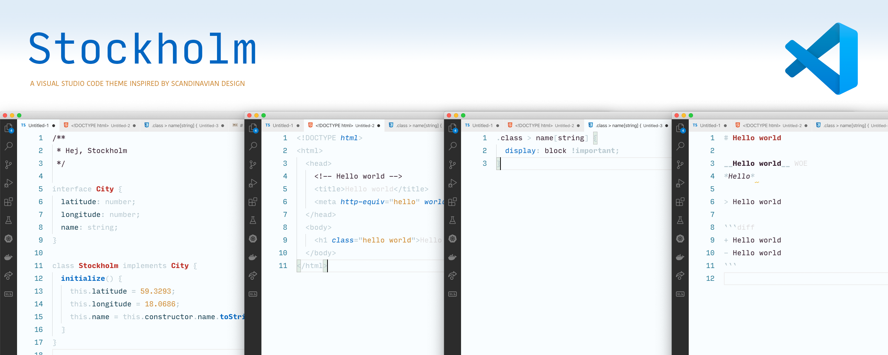

<div align="center">
  
  
  <h2>Stockholm Color Theme (for Visual Studio Code)</h2>
</div>

## Install

```yarn
ext install vscode-stockholm-theme
```

Or go in the marketplace and search for `Stockholm`. Note there are two VSCode themes called "Stockholm", be sure you're installing the right one :)

## Colors

The color scheme passes both WCAG AA and WCAG AAA checks. It was checked using [WebAIM](https://webaim.org/resources/contrastchecker/).

## Contributing

```sh
git clone git@github.com:bih/vscode-stockholm-theme.git
code ./vscode-stockholm-theme
```

Then press <kbd>F5</kbd> to open up a new VSCode with the theme. You can then make changes and see it live update instantly.

## Publishing New Release

1. Commit using [Conventional Commits](https://www.conventionalcommits.org) (i.e. `fix: [describe fix]`, `docs: [describe docs change]`, etc)
2. Update the `version` in package.json. As VSCode themes technically never break, a minor change should be sufficient.
3. Once published, create a new GitHub release with the same version set in Step 2.
4. Success! GitHub Actions will automatically trigger and publish to GitHub Packages (as `@bih/vscode-stockholm-theme`) and NPM (as `vscode-stockholm-theme`). No action is required from your end.

## License

[Apache 2.0](https://www.apache.org/licenses/LICENSE-2.0)
